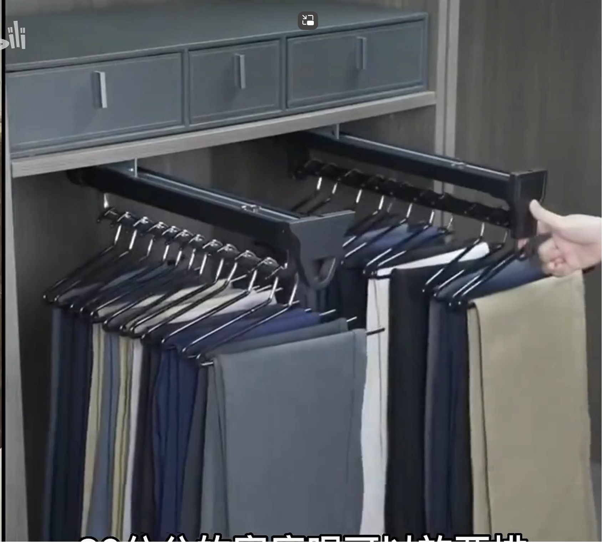

# 全屋定制

## 材料

* 颗粒板：衣柜鞋柜等主要地方
* 海洋板：可以用在厨房、卫生间、阳台
* 柜体用颗粒板
* 柜门看福人精板、红棉花，普通的也行
* 背板用9mm和柜门同材料的，不要用密度板，不能贴墙

## 饰面

* 烤漆工艺：贵、怕磕碰，易变色，但整体性好，好看
* 素板贴面：贴的分三聚氰胺纸、吸塑、pet
    * PET肤感膜：耐磨耐划，但是无造型。有反光的和哑光（肤感）的，适合用在客厅厨房浴室，容易清洁
    * 三聚氰胺双饰面贴纸：样式较多，最常用，最便宜，适合用在卧室
    * 吸塑是用在密度板造型的门板上的，也很贵，不用
    * 贴木皮：最贵，不要

## 配件

* 柜子内部灯光：线型灯开槽16\*0100mm，后期搭配15\*9mm铝合金灯槽，灯带用8mm宽cob两色智能灯带，变压器用智能灯带变压器可用米家
* 灯带位置：氛围灯从格子里往外8cm，展示灯（直接照到物品脸上）从外往里8cm
* 电源位置：开在柜子后面任何地方都行，只要在装柜子之前用一根护套线将电源引导到相应位置即可
* 明装灯槽灯带可以用斜照的 

## 鞋柜

* 分为常用区、备用区；常用区斜板，以放我的大鞋子；备用区可拆卸平板，可以放靴子和长筒
* 要有一两个抽屉，放一些随时出门带的小物件

## 橱柜

* 厨房台面单独找石材商定，因为全屋定制可能不是很了解石材，它们主要做板材的

## 衣柜

* 挂裤子的区域用可拉出的裤架

* 抽屉做外露的，不要把抽屉做到柜子里面

## 浴室柜

* 找定制做一般比成品的贵
* 定制做一般是多层板、颗粒板加pet肤感饰面板
* 卫浴品牌卖的成品一般是太空铝的板子，更防水，但是样式不如定制的多

## 问价

* 楠桂园