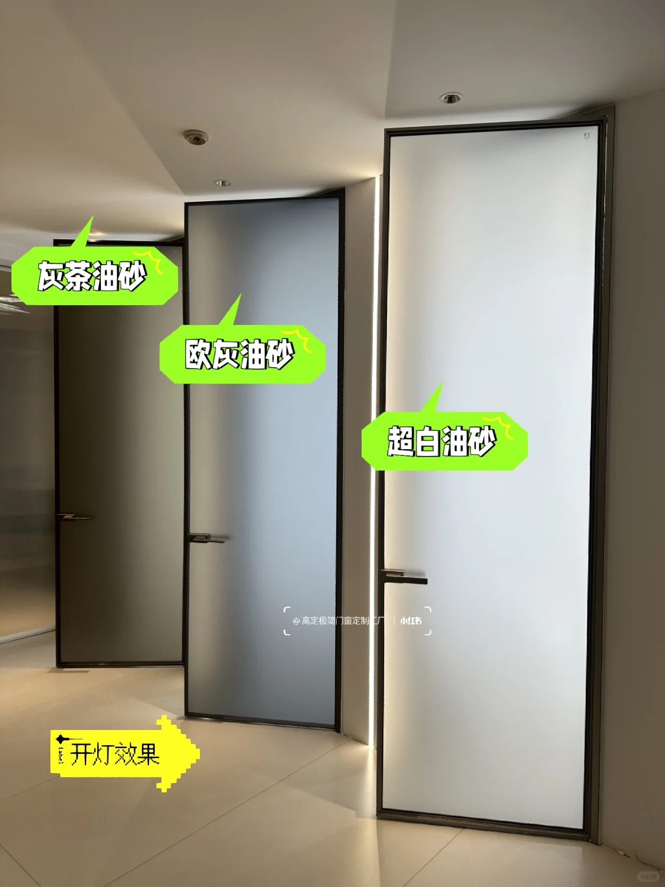
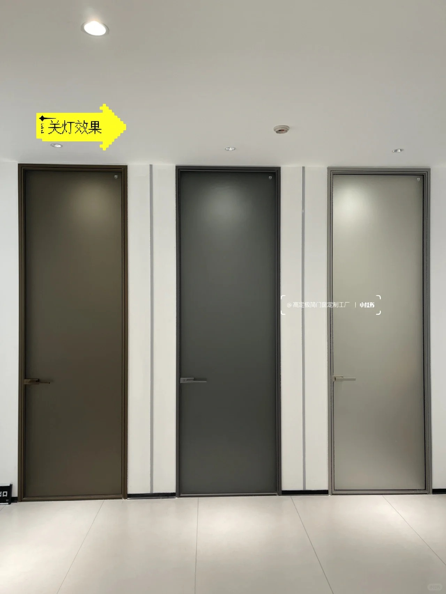

# 室内门选择

## 品牌

* tata：最贵
* 力诚

## 厨房门

* 欧派克吊轨的门
* 厨房门型材用2.0壁厚的
* 单层白玻
* 带阻尼的

## 厕所门

* 双层油砂玻璃，单层油砂玻璃进水了要透明
* 超白玻，普通的发绿
* 单包套
* 天地隐形合页
* 型材2.0壁厚
* 极窄门套3cm以内
* 欧灰油砂不开灯看上去是黑的，白油砂不开灯看上去是灰的

## 卧室门

* 同一空间内门的款式尽量统一，甚至全屋门款式都可以统一
* 门套颜色型材统一，可以都用黑色极窄边框