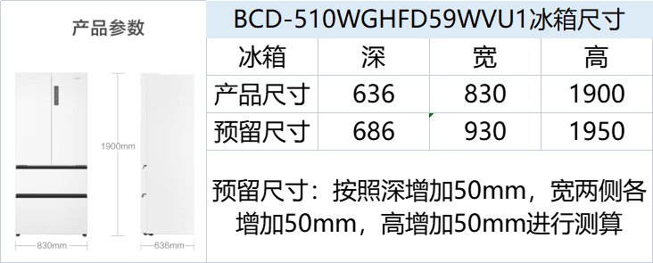
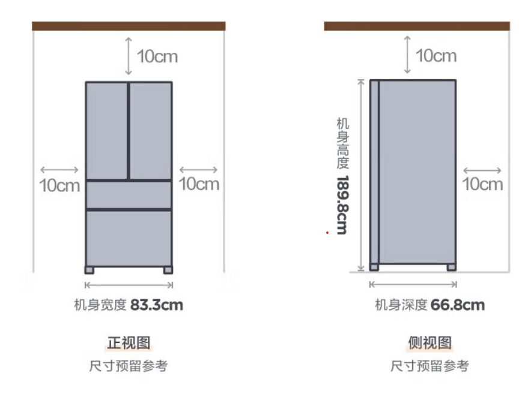
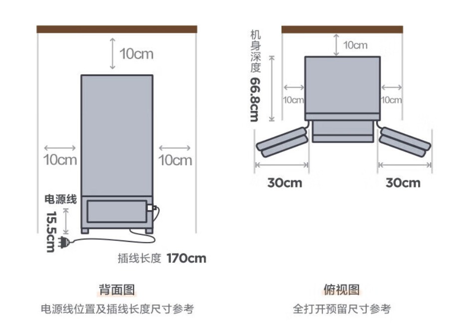

# 家电选择

家电在网上买或者熟人买和网上进行对比，透明价格

## 中央空调

每个内机分p数的，有出风口和吸风口和检修口，所以要根据房间定制。

* 制冷量：120、140、160，指的是12000W、14000W、16000W
* 内机p数：1p=735w输入功率，p数\*735\*能效比=制冷量
* 提升水泵：挺有必要的，可以帮助排出冷凝水，贵不了多少。不是所有空调都可以加
* 1拖x：一个外机x个内机
* 外机风扇数量：影响散热速度，双风扇散热好一些
* 多联机：使用传统空调的制冷剂方式制冷，一个外机拖多个内机。不要水机，要地暖才考虑水机
* 控制方式：类似酒店的空调面板、遥控器、无线局域网功能。vrf控制器接入全屋智能

### 安装相关

* 回风方式：尽量侧送下回，其他的都有弊端
* 铜管：至少0.8mm厚度
* 冷凝水管：U-PVC材质，禁用pvc材质，易脆化
* 内机安装：双螺母双垫片，减震，不得单螺母单垫片；丝杆采用FY10，不用普通丝杆；
* 外机安装：橡胶减震垫
* 工具：弯管器、胀管器、修边器、充氮保护焊
* 排水坡度：千分之五
* 风口软连接：国标三防布，不到国标的不行
* 其他：直管连接用管路连接件，不能直接焊起来，可能漏氟；分歧管间距符合标准；如果有提升泵要用门字形反水弯，避免冷凝水倒流；排水走下水管不走污水管

### 安装问题

* 铜管厚度
* 冷凝水管什么材质的
* 内机用不用双螺母垫片
* 丝杆型号是多少
* 外机有没有橡胶减震垫
* 风口用不用国标三防布
* 管路连接是用电焊还是管路连接件，分歧管间距多少，提升水泵做不做门字型返水弯
* 安装工具有没有弯管器、胀管器、修边器、充氮保护焊

### 价格

* 家博会 美的单风扇 28000
* 家博会 美的理想家三代 1拖5 160 3w1出头
* 海信 和理想家三代差不多，1拖5 160
* 日立 牌子贵一点，东西和海信一样。海信收购了日立
* 家博会 海尔单风扇 23000-24000
* 大金 工厂 1拖5 4w-5w
* lyn 美的理想家双风扇 26000
* 京东线下 美的梦想家pro 26000 120 一拖四 wifi面板 京东安装

### 购买渠道

* 本地线下直营商最好，因为中央空调定制化程度很高，线上购买也是分配一个线下的经销商。

### 要问什么

* 加项有哪些
* 提升水泵收费
* 出风口加长收费
* 质保多久
* 安装收费
* 管道加长收费
* 控制方式更改收费
* 梁上打孔收费

## 厨卫吊顶

* 欧普 3500-5000 两个套餐 铝扣板300*300 小套餐包含两个风扇和灯，大套餐额外包含凉霸一个

## 电视

* 国产TCL、海信最好，TCL有华星光电，是国产唯一能生产屏幕的
* 电视分为LCD（液晶电视，商场里叫的LED就是LCD）和OLED屏幕的电视，花里胡哨名字的基本都是LCD。他们都是自发光的屏幕，但是显色原理不一样。

### LCD(LED)

* 液晶面板分A++、A+、A、B、C几个等级，等级越高坏点越少
* IPS/ADS面板是一回事，可视角度广，硬屏，对比度低，通透性也差一些，观看效果不如VA面板。高端电视用va面板
* VA面板，是软屏，按压会有水波纹。用VAC算法的va电视画面会发虚，不建议购买。电视va面板控光分区超过200分区就很好了，所以电视买va面板的比较好
* QLED是量子点电视，也是液晶面板的一种，量子点就是一种材料，受蓝光之后激发出红光和绿光，从而提升画面的色域。用上了量子点的就是色彩更好的电视。
* mini LED：发光点特别小的液晶电视，因为单个像素点更小，所以细腻的多
* ULED：海信推的mini LED电视

### OLED

* OLED的基本是高端电视才会有，很贵
* 电视的OLED是DC调光，没有屏闪，OLED采用的有机材料，寿命比LCD短挺多，像素点可能会提前老化，从而造成烧屏。OLED亮度没有LCD的亮
* WOLED面板薄
* QDOLED，比WOLED更好，但缺少偏振层，侧面观看有紫红色反光

### 其他

* 很多电视有开机广告，目前知道TCL、雷鸟、索尼没有广告。广告可以打电话找客服关闭，法律规定的，但是关闭了还是做不到秒开电视进系统，要等一会

## 冰箱

* 容量选择：一个人100L
* 除菌净味技术可以认为全没用。什么EPP、臭氧除菌、光触媒，全没用。
* 循环数和系统数用处不大，不如大品牌温控调校更好的
* 系统数就是蒸发器数
* 能效等级一到五数字越小越好
* 选购看升数、开门方式、嵌入式（左右预留空间多少）、是否超薄，品牌就行
* 京东上大多冰箱都是5k-6k（10月）

海尔

* 开门方式：十字门、法式（有抽屉）、对开门
* 嵌入式：要在做橱柜前确定好冰箱，按尺寸定制橱柜，冰箱下方散热
* 控温技术：监测箱内温度从而让温度稳定保持，不会因为东西多冷藏冷冻效果变差。
* 控湿技术：风冷冰箱会加速内部水分流失，蔬菜会干，所以要根据湿度计往里加湿。
* 除菌：很多玄乎的名字背后都是离子发生器除菌，几乎没用。
* 除味：活性炭吸附的有点用，但是吸饱和之后还能不能用不清楚，总的来说有点用但不多。海尔EPP超净
* 控氧技术：减少新鲜蔬菜的呼吸氧化，可以让菜保存更长时间。免费做法：给蔬菜套个袋子密封。
* 保鲜技术：迷瞪测试基本没用，核心在于要让温度稳定，温度不稳定的菜容易坏
* 尺寸。海尔全空间保鲜，干湿分区存储，变温区
* 海尔BCD-466WGHFD15B8U1 5000内

美的

* 尺寸

## 洗衣机

* 冷水洗：支持冷水洗衣，对于纤维衣服有保护作用。大部分滚筒洗衣机都是热水洗的
* 气泡洗：产生很多气泡，利用气泡爆炸的力量来清洁衣物
* 电机：大部分都是bldc皮带变频电机，fpa直驱电机噪音更小，寿命更长。皮带电机六七年之后要更换皮带

海尔

* 智能投放：有点用，可以根据衣服自动放洗衣液
* 精华洗：省水，先把水和洗衣液混合，再投入洗衣舱。传统的是在洗衣舱中浸泡混合的，混合不是很充分，洗衣效果不如预混合。
* 甩干转速：

小天鹅

* 水魔方：支持冷水洗和气泡洗
* 除菌技术：uabt紫外线银离子杀菌

## 烘干机

洗烘套装：小天鹅86+32性价比很高的时候是3000+到4000开头，尺寸

* 热泵烘干：是低温烘干，更护衣物，效率较高，去毛效果好，省电
* 冷凝烘干：
* 正反转：可以更容易抖散衣物，烘干更彻底。一般的都是8:1，海尔高端款176有1:1正反转
* 噪音大家都差不多，50-60分贝，如果衣服上有金属会撞击得很响，可以用一些小的纸包把扣子拉链包起来

## 洗碗机

* 清洁指数：越高清洁能力越强
* 喷淋臂设计
  * H型喷淋臂（海尔）：可以上下两向喷
  * 上下分层洗：可以用于碗比较少的情况，稍微省点水
* 洗涤模式
  * 高能气泡洗（方太）：在喷水的时候通过文丘里管带气泡，洗涤效果很好。水压能到4万pa
* 水压：水压越大理论上洗净能力越强，感觉4万左右够了
  * 海尔有5万pa的
  * 美的rx600pro基本款3万5千pa
* 烘干技术
  * 晶蕾烘干（西门子、博世）：一些石头遇水升温，吸水性很强，可以吸掉机器内部的水蒸气从而制造干燥的高温空气。是纯内循环，效果可以但是贵
  * 开门烘干（美的）：洗完了自动开门，引入外面冷空气形成对流，烘干很快效果不错省电，适合洗的多的情况
  * 热风烘干（方太）：抽外面的空气加热吹进来，效果也还行，能耗稍高
* 除菌技术：保存技术，有的可以保存一周
* 线下 s55 4999 热风烘干 14套 可分层洗 变频电机

海尔W5000 迷瞪4900

## 烟机灶具

方太、老板、华帝

美的很多产品都是老二

### 油烟机

* 新国标：GB/T 17713-2022，第一起草单位是方太
* 侧吸：噪音大，面板容易沾油需要经常清洗，吸烟效果好，不易碰头。现在大部分都是侧吸
* 顶吸：吸烟效果不好，但好看可嵌入，噪音低
* 侧顶吸：侧吸大吸力，顶吸防逃逸，贵
* 风量：17-22立方，风量越大噪音越大
* 最大静压：向烟道吹风的力量，我们几乎不用考虑。1000pa的是好的
* 止逆阀：烟机安装时要安装，防止别人的油烟灌进来
* 声压级噪音：噪音的指标，国标是73dB。要求声压级噪音+14<=73dB
* 油脂分离度：滤网越密油脂分离度越高，但是越容易被凝结的油堵住。油脂分离度低了油就会附着在电机等部件上，久了对电机伤害很大。一般分离度高的品牌都有办法选密度刚好的滤网，尽量拦住油，且不会被凝结的油堵住。所以油脂分离度越高的型号一般都更好。方太老板能做90+
* 自清洗：各个厂家不一样，热干洗、高温蒸汽洗、高压水洗好于智能旋转干洗。外部面板需要自己清洗，油脂分离度越低外面板越不容易沾油。本质上自清洗只是延缓拆机清洗的时间。方太老板根本没有自清洗，因为它们的油脂分离度比较高，不容易沾油。
* 要想安装成尽量无缝，应该先安装油烟机，再安装吊柜
* 工作风量：新国标提出
* 工作噪声：新国标提出

### 燃气灶

* 热效率：热效率>=59%（一级能效），高的出一氧化碳少
* 热负荷（火力）：因为要爆炒，所以要选4.5kW-5kW甚至更高的
* 面板有两种：不锈钢和钢化玻璃，钢化玻璃小概率爆裂，但是易清洗
* 天然气软管加点钱换成不锈钢的，更加耐用
* 点火方式：电脉冲、压电陶瓷，好点的都用电脉冲
* 进风方式：全进风的
* 锅支架铸铁的便宜抗造但是易生锈，搪瓷的没铸铁抗造，但是易清洁
* 炉头火盖选铜合金的，铁制最差。铜合金最基础款式53%含铜量，含铜量越高越好
* 火盖上的火孔：条形比圆孔的好，热效率高
* 熄火保护：国家强制，有就行。离子感应式熄火灵敏但这玩意坏了整个灶都不能用了；热电式稳定可靠，但熄火5秒后才能停气，无安全风险。
* 价格不超过一千也能买到不错的，1000-2000带防干烧功能，做工好，2000+不必要了

### 价格

* 美的烟机yp23 灶具q623 4599 航空材质火盖 灶5kw功率 烟机7字侧吸 蒸汽洗
* 老板29a9s 全纯铜 26立方 6500

## 燃气热水器

* 出水量：每分钟输出升高25度的水的升数，双卫16L挺好。
* 水伺服：出水口一个电机可以监测水温，如果热水没达到设定水温则自动调小水流量从而让水流慢一点以达到设定温度。多人同时一开一关水温不会影响，有点用。
* 下置风机：风机远离高温的燃烧室，让热水器寿命更长，吹进更多氧气，燃烧更充分，产生更少一氧化碳
* 热交换器材质：铜的好，不锈钢不适合江边用。
* 微火控温：有很多个燃烧头，可以更精确的调整火力大小
* 降噪：挺有用
* 封闭式燃烧室：燃烧加热水的管子那个部位是封闭的，尽可能的让燃烧的热量传导到水中，以达到节省燃气的目的。
* 防风火源：和防风打火机一样的原理燃烧，以防风。
* 零冷水：随时水龙头打开立即出热水，要预埋回水管。热水管道长的更需要零冷水。不是特别需要
* 瀑布浴：出水口有一个增压泵，水压不够则可以增压。没太大用
* 一级能效：燃气燃烧的热量97%以上全变成水温，节能。只有上置风机才能达到一级能效。一级能效的都是冷凝机，需要排出冷凝水，不太好。
* 美的 16m4 2999 水伺服 16l
* 美的 mate 2000以内 下置风机 增压水伺服 密闭稳燃舱 薄

### 品牌

* 万和没有下置风机的，全系列都是3k以下
* 海尔和美的都挺好
* 万家乐有下置风机，还没看

## 购买地址

* 中国燃气慧生活暖居体验馆 重庆市渝北区双湖支路6号-1-6号