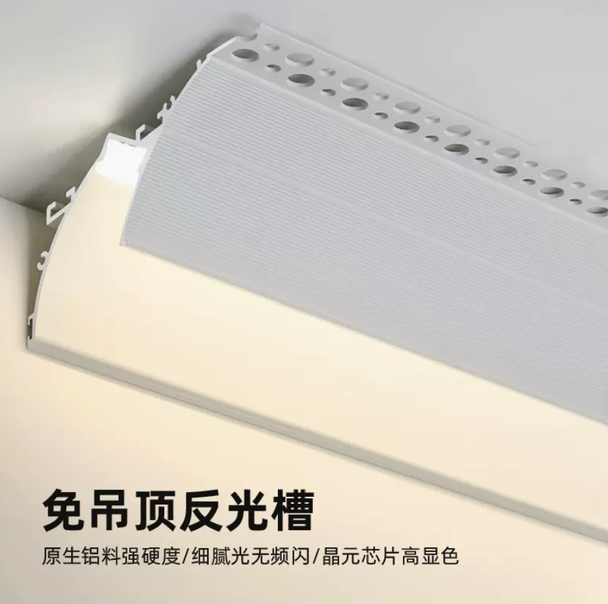

# 灯光设计

* 卧室可以用吸顶灯；客厅使用筒灯、射灯、灯轨道、灯带进行无主灯的设计；鞋柜，床头等地方使用感应灯照脚下，以防止踢到脚。

## 光的概念

灯光设计要考虑到空间的结构性。所谓的无主灯设计核心理念就是，给每个功能区单独的灯光。所以无主灯简单的说就是给饭厅多个灯光，客厅多个灯光，门廊多个灯光。拓展一下，要利用三维立体的灯光设计，灯不一定是从顶上射到地上的，可以是横着的，漫反射出来的。

## 灯具选择

中山是中国的灯城

灯由灯具、驱动、芯片构成

筒灯就是普通的圆筒上面挂个灯；射灯是灯周围用镜面反射改变光的方向，达到让光照向一个方向的作用。

灯轨道是一条轨道，可以将各种灯通过磁铁吸在上面，比较好造型和diy

* 色温：4000k客厅，3500k卧室
* 功率：
* 显色指数：Ra>95的灯具，重点关注R9，显红色，要高到和其他差不多，蓝光尽量压低一点。
* 色容差SDCM：色容差高了同样4000k会有偏色情况，要色容差小于3SDCM的比较好
* 灯功率越高越需要散热，用久了之后发光能力会下降。冷轧钢散热好一些

### 灯带

* LED灯带：一般是一米120个灯珠，亮度比COB亮一些
* COB灯带：整个灯带是一根连续的，出光更柔和，但是放白色灯罩内几乎看不出来差别

### 驱动

* 莱福德：好用不贵
* 伊戈尔：好用不贵
* 飞利浦：更好用，更贵
* 瑞高：奥地利牌子，最贵最好用

## 购买渠道

* 大石坝找

### 品牌

* 歌宁品牌店（个人）
* koey
* 易来

## 照明设计

* 住宅建筑照明标准值：GB50034-2013
* 照度标准基本原则：一般活动75-100lx/m2；操作、阅读或就餐150lx/m2；书写300lx/m2
* 利用系数（照明率）：0.42
* 维护系数：0.8
* 发光效率：80lm/w
* 光源利用率：反光灯槽0.15、正灯槽0.2、线性灯0.8、装饰灯0.9、射灯1.0
* 平均照度：(总光通量\*利用系数\*维护系数)\/房屋面积
* 灯具总光通量=基础照明光通量+重点照明光通量
* dialux傻瓜式计算。

### 设计原则

按照基础重点氛围照明或者高中低位照明原则来设计灯光，其参数由上方的公式计算

### 基础重点氛围照明

* 线性灯、铝槽灯带、磁吸轨道泛光灯、背景灯带都是基础照明的。基础照明提供室内的照亮需求即可。免吊顶反光槽可以用起来

* 重点照明用SQ-36射灯、SQ-24射灯，哪里需要光就给他来个射灯。轨道灯贵，可以不要
* 氛围照明用窗帘灯带、落地灯灯带、电视柜灯带。

### 高中低位照明设计

* 高位照明指的是人正常站立时头顶上射下来的灯光，提供的是基础的照明功能。
* 中位照明指的是对于特定的功能，特定的物品上面起强调效果的灯光。比如壁画射灯、电视柜灯光、橱柜下灯带、镜前灯、马桶灯、立式台灯等。
* 低位照明指夜间或是某些场景下用于指路及烘托氛围的灯光。比如夜灯，踢脚线灯，电视墙下方看电影时的氛围灯。

### 家居照明5步设计法

1. 准备工作
   1. 确认空间信息：长宽高、门窗位置、吊顶深度
   2. 了解家具配置：家具位置、款式颜色
   3. 收集业主信息：业主年龄、兴趣爱好、空间作用、喜欢明还是暗 
2. 设置主灯光：照亮整个区域的灯光，可以是主灯，也可以是多筒灯。房间对角线长度的10分之1到8分之1作为主灯的直径
3. 设置环境光：
   1. 对于人的驻留区域（沙发、餐桌、阳台、厨房），分析每一个驻留地视线可能停留在哪里，就对哪里进行重点照明。比如在沙发上会看电视、看盆栽、看展示柜、看阳台，在餐椅上会看餐桌，看挂画。
   2. 洗墙灯总宽度是墙宽度的一半，灯和墙的距离是灯和灯距离的一半但尽量在400-600mm范围
   3. 要注意避开不想照亮的东西，比如空调
4. 设置灯光场景：按使用场景来分析灯光是否合理，比如吃饭场景，看电视场景，餐桌上一边工作一边聊天场景
5. 确认整体效果：把所有灯同时打开，看可不可以合并，能不能简化

## 分区布灯

### 餐厅

餐厅可以使用长排吊灯，长度比桌子短30cm，灯具高度75cm左右，造型要简单，不要泛光与侧透的，要光线朝下刚好覆盖桌面。不要射灯，容易刺眼。  
同时可以在上方加上吊顶边的漫反射光源，作为基础照明。  
高级感的话，可以给餐边柜一个下踢脚线灯光，作为低位照明。

### 客厅

* 平均照度150lx/m2
* 色温3500k-4000k，整个空间色温要一样
* 功率7-9w
* 坐沙发上不要直接看见光源，可以拿几个射灯照沙发背后过道

## 其他经验

* 洗墙射灯不是很建议，容易直接显示出墙面的瑕疵，比如不平等问题。可以在天花顶部安装漫反射灯带

## 价格参考

* 新特丽 南坪灯饰广场
  * 显指92
  * 筒灯100多，射灯300多，灯带带型材180/m
  * 色容差不知道，估计很高
  * 解放碑店有检测设备
* 西顿 南坪灯
  * 显指挺高90以上吧
  * 射灯一百多？也有三百多的，可以接华为智能，散热更好
  * 射灯散热铝的
  * 灯带58一米不含灯槽，光衰10米
  * 色容差宣传2以下
* 木林森 南坪灯西顿店内
  * 灯带宣传显指95，r9>96，色容差2以下
  * 线形灯光衰10米20米，十几块一米
  * 好的射灯120多一个，一般的60多？
  * 灯带十几块一米不含灯槽
* 欧曼 南坪灯
  * 灯带顶配21一米，嵌入式灯槽10一米
  * ra95
* 雷尼司 南坪灯
  * ra95
  * 射灯一百多到200多

