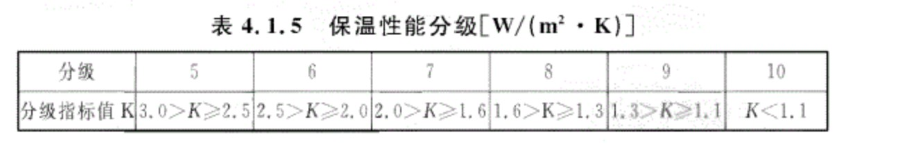

# 窗户选择

* 长4980，侧1500左右，高2.4m左右
* 5+12Ar+5+12Ar+5单银Low-E：三玻两腔，中间充氩气，最外层单层银面层low-e玻璃
* 5+12Ar+5+12Ar+5双银Low-E：三玻两腔，中间充氩气，最外层双层银面层low-e玻璃

三层中空玻璃，最外层low-e高透，铝条插角一体弯折工艺，原生铝有检测报告6063-T5型号规格，pa66 GF 25尼龙隔热条，壁厚1.8mm，五金要大牌，外低内高导轨挡水，排水口内外导轨都要要，还要加地漏式排水，窗户外沿增加向外流水的斜坡，密封条三元乙丙橡胶条。腔体越多隔热越好
刘依宁600一平左右

系统门窗是有国标的

## 平开窗

* 两个导轨外低内高，用于挡水，可以在内部有一个挡水板
* 内开内倒
* 外开加防坠链

## 断桥铝

* 关键在于其中的隔热条，断桥铝窗户隔热就是靠隔热条，要性能好，寿命长，承受温差高的。
* 隔热条有pvc和pa66（尼龙隔热条）。很多垃圾厂商用pvc材质，国家已经明令禁止使用pvc了，需要注意。
* pa66全称pa66 GF 25，中间加了25%的玻璃纤维。pa66隔热条上方会印有编码。
* pa66隔热条要用原生材料
* 隔热条形状分为I型、C型、T型、空腔条
  * I型条最简单、力学性能最好、可能积水漏水、隔热稍差
  * C型条隔热最好、更易排水
  * T型是I型的改进，让断桥铝形成“等温线齐平”
  * 空腔条是最终形态，应该最贵，各项性能都是最佳
* 隔热条越宽隔热性能越好
* 玻璃间隔条是铝条或各种品牌的暖边条，暖边条一般是密封玻璃，保存氩气效果更好，整体性能更好
* 铝条插角工艺，要一体弯折的，不要拼接的，拼接的容易漏气
* 多腔体工艺，腔体越多窗户越稳定，和保温性没关系

* 氟碳漆喷涂更好，更耐磨好看，粉末喷涂工艺是撇的
* 中间隔热条在关闭状态一定要封住，否则没有任何隔热效果

## 玻璃种类

* 白玻：爆率比较高便宜
* 绿玻：爆率比较高便宜，隔绝紫外线
* 超白玻璃（最贵）：光线透过率最高，要阳光的必选。不能反射红外线，夏天很热
* low-e玻璃：隔紫外线，隔热，但会拦截一部分亮度（光线透过率没这么高），帮助家里节能。low-e玻璃有不同的透光率选择，越黑的越节能。重庆用这个比较好，但是要选择合适的透光率。有单银玻璃、双银玻璃、三银玻璃之分，银面层越多透光率不一定越低，但是越贵。

## 玻璃工艺

* 夹胶玻璃：安全，爆了不掉下来、隔音
* 双层中空：中间要充氩气，以达到更好的保温效果。氩气会漏
* 三层中空：俗称三波两腔

## 窗户五金

* 要用大品牌的，不说的肯定是杂牌
* 国产派格、坚朗
* 国外好博、希美克、诺托

## 玻璃厚度

3平以内用5mm厚钢化玻璃
超过5平米用6-8mm厚的玻璃

## 密封胶条

* 三元乙丙密封条

## 玻璃间隔条

指两块玻璃中间的那个间隔条，最常见的材质是铝条

* 一般使用的是铝制的边条，一体折弯工艺的。铝条也称为冷边条
* 要想保温性能好，应该使用暖边条，暖边条种类很多，只要导热系数小于0.007的都是暖边条
* 暖边条一般是TPS/4SG隔热条、聚丙烯+不锈钢，导热系数比铝条低很多
* 用TPS/4SG的一般是大厂才能做，要和两块玻璃一起做成整的玻璃，密封保温特别好，小厂做不了
* 暖边条也有防止玻璃起雾的效果
* 暖边条成本和铝条差不多，不算增配项

## 金刚网

我们的可能没有，有的话选高透金刚网

## 角码工艺

* 销钉注胶工艺很好
* 光销钉的就要差一些
* 有的商家做假注胶
参考：[销钉注胶角码](https://zhuanlan.zhihu.com/p/581503229)

## 保温性能

国家有窗户保温性能的检测，好的商家做了保温检测看他的报告上的保温等级

## 安装

* 安装在滴水线以内3cm以上
* 固定片固定和膨胀螺丝固定，膨胀螺丝不能用塑料的，得用铁的
* 膨胀螺丝不能打在隔热条上
* 安装完了要打密封胶

## 重庆标准
参考

* 《民用建筑外门窗应用技术标准》DBJ50/T-065-2020
* 《居住建筑节能65%（绿色建筑）设计标准》DBJ50-071-2020

杨坤推荐

* 型材宽度：平开65以上，推拉80以上
* 型材壁厚：窗户1.8mm，门型2.0mm
* 隔热条宽度：18.6mm以上
* 发泡填充：无
* 玻璃厚度：中空12mm，玻璃厚度5mm以上
* 玻璃间隔条：普铝冷边
* low-e：离线单银 辐射率ε≤0.1
* K值≤2.5