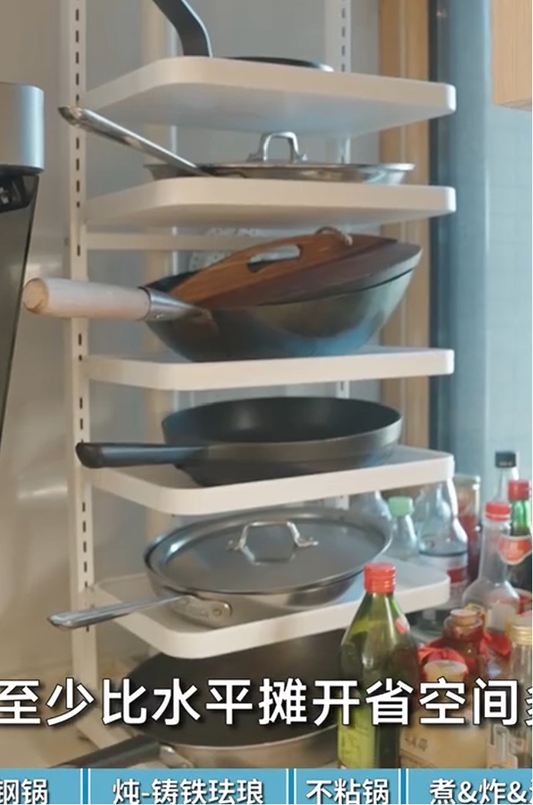
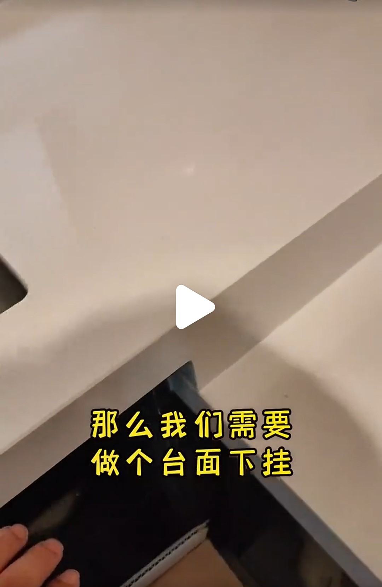

# 厨房设计

## 厨房门

* 使用没有装饰的白玻璃，后期用玻璃贴纸在上面做装饰，可以随时更换

## 水系统

* 暖通公司把这个称为全屋净水，但是分开看全套5000内就能搞定，而且不用装全套
* 安一个前置过滤器，可以保护全屋水路用水设备，而且不贵。
* 前置过滤器需要具备反冲洗功能，它不用更换滤芯
* 前置过滤器主要看过滤精度、流量、材质，40μm、4T/h、铜的就够了，能过滤泥沙就好
* 安装ro净水装置，直饮水用。600G以上。要自己买每个部件组装，品牌的很贵
* 软水机不接入饮用水管路，生活用水使用
* 软水机流量1T/h就够用
* 软水机出来的水可以烧开饮用吗？钠离子会超标吗？据说有锌离子？

## 厨房下水

* 有油污的地方下水不能做pvc的存水弯，否则会容易被油污堵住，还要用75管做45度坡。
* 厨房水槽下水一般会自带一个可拆卸的存水弯防臭装置，够用了。
* 厨房水槽的pvc管要带点坡度

## 厨房器具

* 熟铁炒锅：适合高温快炒爆炒，热得快，重量轻，可颠勺，但热得不均匀，离火冷得也快。不适合炒番茄鸡蛋等酸性菜，容易把油膜腐蚀了
* 不锈钢平底煎锅：导热性好，只烧中间，四周也可以比较均匀的热起来，适合煎。用全包覆工艺，不锈钢中间夹了铝。这种锅性质稳定，什么菜都能做，还能进烤箱
* 铸铁珐琅锅：储热性好，热得很慢，类似于砂锅。可以进烤箱，比较好看。黑珐琅（铸铁层）每次用完需要烧干、涂油；白珐琅（搪瓷层）不用，好保养一点，但是要注意品质，差的搪瓷容易碎
* 特氟龙不粘锅：不超过250度都行，别干烧，不能用铁铲，不要做螃蟹之类的硬食材。用两三年得换
* 不锈钢酱汁锅（小铜锅、雪平锅）：外层铜内层不锈钢，或者不锈钢夹铝的，导热快，薄，适合煮面，做酱汁
* 油炸锅：有温度计，需要可以买
* 黑榜：熟铁平底锅不行，熟铁这个材料就不适合平底锅；里面带格子的不锈钢不粘锅，啥啥不行
* 收纳

## 橱柜设计

* 地柜做高低台
* 高台的部分做台面下卦，低台不做

* 洗切区高度为手肘高度-150mm
* 炒菜区高度为手肘高度-230mm

## 橱柜拉篮

* 悍高拉篮：底板基本都是304不锈钢，四周不一样，有玻璃的，有太空铝的，有304不锈钢的，个人觉得用太空铝的比较好