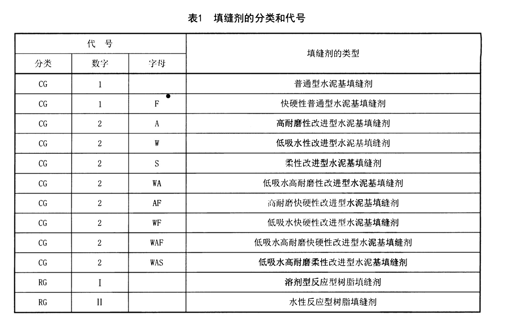

# 瓷砖选择

佛山是中国瓷砖之都，国产选这里的不错。但是实际上很多肇庆、广东等地方生产，去佛山贴牌的砖。注意甄别

种类分为陶制砖和瓷质砖

## 物理性质

陶制砖吸水率更高，硬度更低，陶内部空洞较大
瓷质砖吸水率更低，硬度更高，内部空间更致密

## 类型

* 从表面亮光程度来分，分为哑光砖<柔光砖<亮光砖
* 防滑程度哑光砖>柔光砖>亮光砖
* 易清洁程度哑光砖<柔光砖<亮光砖
* 柔光砖分为6种工艺：细干粒、柔抛、肌肤釉、哑光刷抛面、糖果釉、锻光/柔光面，绝不能选柔抛，肌肤釉感觉不错
* 真正的柔光砖，出场就是柔光的，不是给亮面砖的釉面上用柔抛技术，这种柔抛砖破坏了原本的釉面，很不好

## 装修工艺

* 瓷片泡水后再贴，可以在上墙后不吸收水泥砂浆里的水分，粘贴更牢固，不容易收缩。不泡水就像我们的厕所瓷砖那样裂了。
* 验收瓷砖时用硬币在四个角转一下，不能卡住，卡住说明没有找平
* 海棠角要包进贴砖钱里面，很多公司把它算成增项，而且很贵
* 海棠角要事先让瓷砖店老板确定有多少块做海棠角，确认后让工厂水刀切割，工人现场切割效果没这么好
* 贴砖的时候要用水平仪打激光，以防贴出来不方，从而有缝
* 不能用海沙，要用河沙，海沙会长真菌
* 地砖铺好后，要在上面铺石膏板，很便宜十来块一张，可以防止后续步骤刮伤瓷砖以及掉沙

## 选购要点

* 看外包装上的国标等级以及生产地址到底是哪里，所谓的广东砖可能是广东品牌，不一定是广东生产
* 胚体：瓷砖背面，地砖要瓷质砖，吸水率小于0.5%，倒水上去不会吸收，砖立起来弹一下中间，有铜钟一样的声音；胚体颜色洁白无杂质；背面滴墨水，不渗透才是低吸水率（低于千分之三）的
* 釉面：瓷砖正面，防滑系数要在0.5以上；用刀子钥匙画不出道道
* 平整度：两块瓷砖正对正贴一起，看看是不是能贴死，边角有没有翘起来；左右排列一起，看看接缝处整不整齐；
* 尺寸公差：测量砖的两条对角线，看相不相等；四块砖排一起，边角能完全对齐
* 防污性：用油性马克笔写上去，等干了擦一下看好不好擦
* 防滑性：倒水上去，用脚兹几下，看看滑不滑，好的砖都不滑

不要管砖的名称，太多了而且没有规范，认不完的，要关注砖的各种性能。
防滑性高了，防污渗水能力就差了，本质上是砖表面的平整度和孔洞多少。
硬度，跟店里高档的瓷砖硬度对比，不要差太多就行。没必要用钥匙什么的去划。
买瓷砖好看是最重要的，要配合家庭装修风格。质量一般不是问题。
不要用装修公司特供的砖，来源不明。

## 价格

* 300\*300 品牌瓷砖 几块到十几块
* 300\*600 十几块，节假日可能打折
* 800\*800 几十到几百，几十的很可能贴牌，比较薄质量差，建议不考虑
* 重庆柔光二三线牌子可以按照40以内35-37去砍价800*800
* 方林冠珠 800略粗糙的柔光，68 4*8的柔光33
* 金圣 800柔光天鹅绒，68
* 英超 800柔光天鹅绒 45
* 大角鹿 800柔光天鹅绒 53

## 国标

GB/T 4100-2015 陶瓷砖

* 低吸水率瓷质砖，精细，A1a类，不要炻质砖

## 瓷砖店种类

* 品牌店直营
* 电商品牌
* 个人小店

## 行业现状

大品牌要保护代理商，所以在避免做电商，给代理商保留利润。因此价格波动会比较大，需要仔细甄别。

## 踢脚线波打线（boundary）加工费

1 2 3元一米 

## 瓷砖胶

有C1、C1+（C1增强）、C2这些国标的瓷砖胶，墙上薄贴大砖要用C1+或C2的瓷砖胶，C1的粘接力不够。C1+最多用在600*1200的砖上，再大要C2。

## 美缝剂

种类：
1. 勾缝剂：别名水泥基填缝剂，主成分白水泥，以前的老产品，快淘汰了
2. 美缝剂：成分环氧树脂+颜料。亮面的颜色，具有一定的抗污性
3. 环氧彩砂：成分环氧树脂+玻璃采砂。颜色是哑光的。防水，适合在卫生间；容易吸附油烟污垢不好清除，不适合用在厨房。
4. 聚脲：主成分天冬聚脲。耐污性很强。

* 价格：1&lt;2&lt;3&lt;4
* 价格合适的话可以选择聚脲

实例：
* lyn全屋聚脲花了不到一千

国标：  
* JC/T 1004-2017 陶瓷砖填缝剂

水泥基填缝剂很便宜施工也便宜，但是一定要买CG2WA标准的，要不然会吸水报废。
* JC/T 2435-2018 单组分聚脲防水涂料
聚脲的国标，理化性能是有规定的，但是本质上是防水材料用在填缝上，是一种尝试。

## 重庆选购地点

* 马家岩建材城
* 巴南瓷砖基地
* 巴山