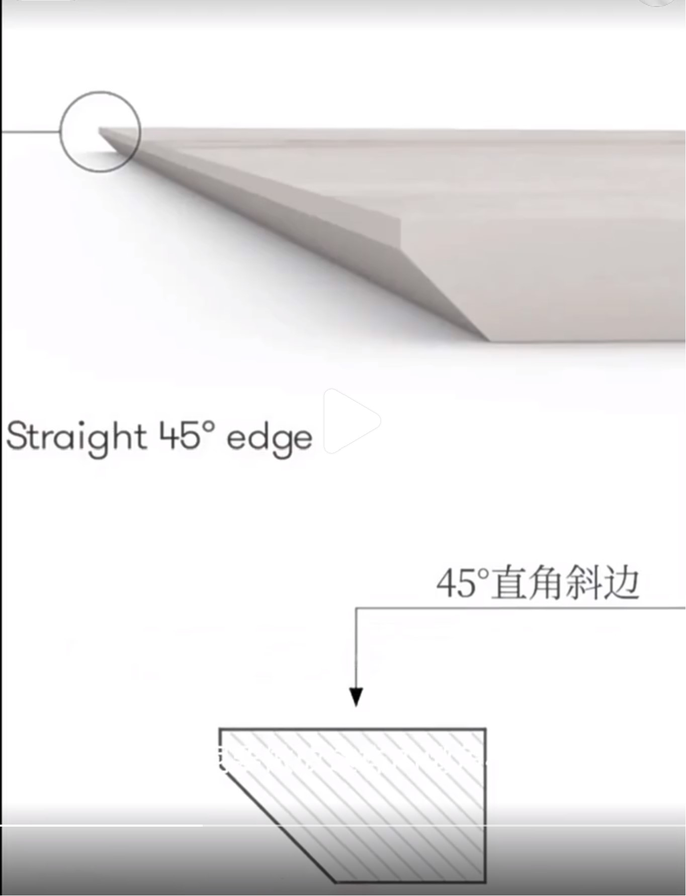
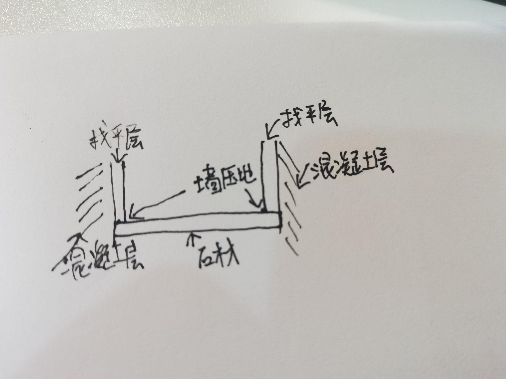

# 卧室

* 窗台石浅色的都行

## 施工要点

* 极简窗台石：石材切45°斜边，安装后在倒角处回填嵌缝石膏，接缝要贴网格布，再刮腻子和乳胶漆，没有耳朵

* 窗台石安装要点：窗台石两边底部挖2-3公分到红砖或承重墙，石材长度比两边找平层要长一点，两边做墙压地，放进去石材了再用水泥砂浆找平，刷乳胶漆，这样墙直接在窗台石上方

## 开关数、插座数

* 主卧：五孔7个、六类网口2个、三开双控1个、双开双控2个（或者双开双控3个、中途开关1个）
* 多功能房：单开双控2个、五孔9个、六类网口1个
* 次卧：单开双控2个、五孔4个、六类网口1个
* 总计：单开双控4个、双开双控2个、三开双控1个、五孔20个、六类网口4个

## 需要告知施工方的

* 主卧的主灯三控，进门、床左右两边
* 主卧的床头灯带和床头柜灯单控，都在床头柜上方
* 主卧厕所门口的路灯双控、进门、梳妆台上方