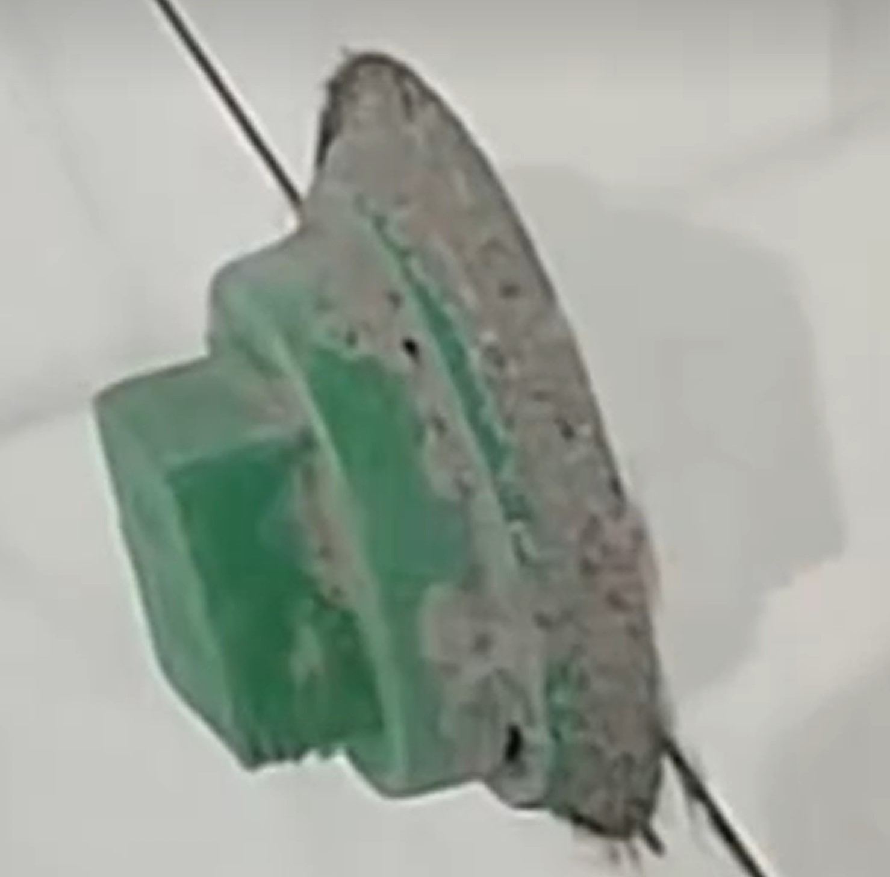

# 厕所

## 开关插座数

* 主卫：五孔2个
* 公卫：五孔1个
* 总计：五孔3个

## 施工注意事项

* 地砖和墙砖做地压墙，留朝天缝
* 地砖和地漏一定要留缝，地砖和pvc管道一定要留缝，才能把美缝剂压实填满
* 所有美缝的地方要有2mm

* 花洒的冷热出水口开槽深度要不多不少，贴完砖后持平，才能把花洒安装严实

* 洗手盆都做90度墙排
* 厕所门都做外平内开，门和外墙齐平，向内开门