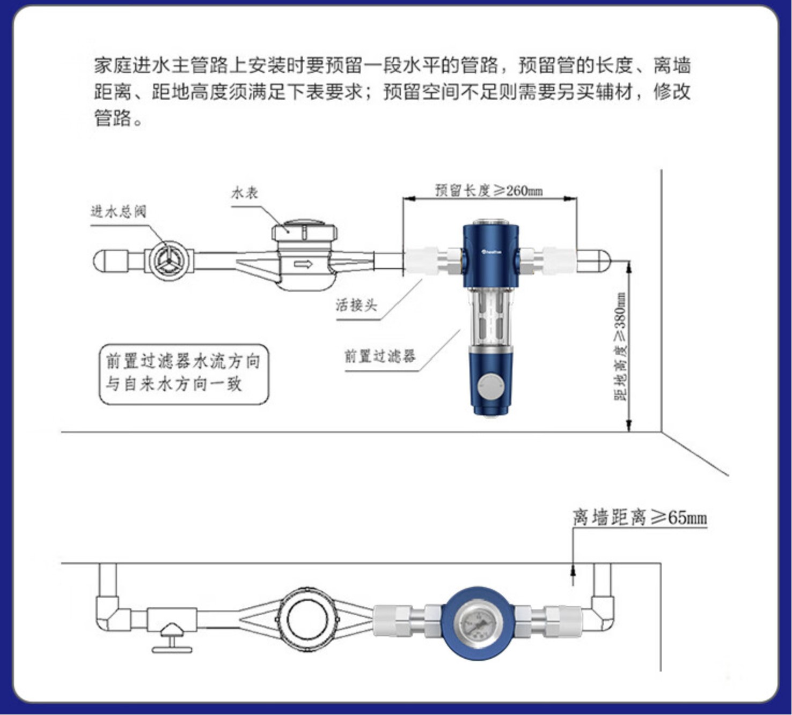

# 厨房

## 开关插座数

* 灶台面：五孔4个、五孔一开单控2个、单开双控2个
* 水槽面：五孔2个、五孔一开单控2个、单开双控1个
* 冰箱面：五孔1个、五孔一开单控2个、单开双控1个
* 总计：五孔7个、五孔一开单控6个、单开双控4个

## 施工要点

* 全屋总进水口要注意离地高度，要可以安装前置过滤器的高度。惠尔顿前置，离地高度大于等于380mm，离墙距离大于等于65mm，长度大于等于260mm

* 美缝使用桶装RG2环氧彩砂，比CG2WA更耐油污
* 地砖和墙砖做地压墙，留朝天缝
* 地砖和地漏一定要留缝，地砖和pvc管道一定要留缝，才能把美缝剂压实填满
* 所有美缝的地方要有3mm

