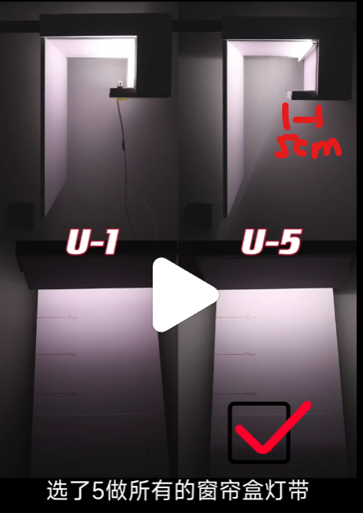

# 客厅

* 地砖：800*800柔光砖
* 电视柜：落地
* 电视墙：上下有灯带，曲形延申至阳台
* 无主灯：餐厅上方三颗，沙发左右各一颗，茶几顶上四颗，卫生间外一颗
* 阳台：推拉窗封窗
* 餐边柜：里面有灯带，有玻璃柜
* 卫生间外柜：下方是扫地机器人，扫地机器人下水墙壁穿孔到生活阳台排水

## 灯具线路及开关

* 玄关灯具1路
* 鞋柜台面1路
* 客厅过道1路
* 餐桌1路
* 沙发1路
* 茶几1路
* 电视背景墙1路
* 客厅回型灯带1路
* 阳台1路
* 窗帘灯带1路

## 施工注意吩咐工人的

* 窗帘盒宽度要22cm以上，才能装梦幻帘12cm宽片
* 阳台左右两侧都要预留电动窗帘位
* 客厅灯带和阳台窗帘盒灯带做法
