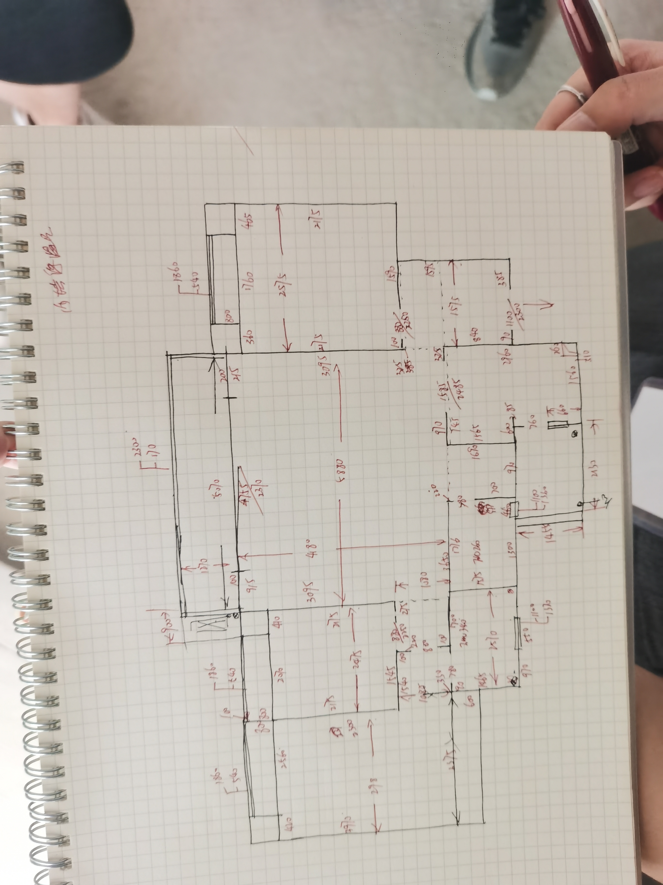

[返回](../zx.md)

# 家里尺寸

* 总面积：31.2994+6.438+15.719+7.367+7.668+9.551+3.09+3.765+2.797+1.143=88.83
* 半面积：6.438+1.143+2.384+1.984+2.068+3.099=17.116
* 总柜子投影面积（高按2.5m算）：(2.67+0.97+3.1+3.35+1.5+1.5+0.3)*2.5=33.475
* 次卧窗边柜长度：2.58
* 总橱柜长度：4.99*2=9.98
* 总木地板面积：15.719+7.668+7.367=30.754
* 总地砖面积：31.2994+6.438+9.551+3.099+3.765+2.797=56.9494
* 总踢脚线长度：30.31m（粗略估算，实际购买需要增加冗余量）
* 800*800环氧美缝面积：6.6
* 400*400环氧美缝面积：2.7+3.8=6.5
* 400*800环氧美缝面积：19.824+18.048+13.968=51.84
* 800*800水泥基美缝面积：39.5+3.1=42.6
* 400*800水泥基美缝面积：10.032

依据：

## 客厅

* 面积：24.578+1.2474（卧室过道）+3.835（玄关）+1.639（厕所门口）=31.2994
* 鞋柜面积：2.67*2.5（预估高度）=6.675
* 卫生间外柜面积：0.97*2.5 = 2.425
* 餐边柜：3.1*2.5=7.75

## 阳台

* 地砖面积：1.26*5.07=6.3882
* 窗户面积：(1.53+5.3+1.53)*1.23=10.2828
* 窗户转角柱：1.23*2=2.46
* 窗帘长度：7.6

## 空调机位

* 面积：1.143

## 主卧

* 面积：11.83+0.663（次卧墙壁差）+0.842（主卧进门）+2.384（飘窗）=15.719
* 柜子面积：3.35*2.5（预估高度）= 8.375

## 多功能房

* 面积：5.383+1.984（飘窗）=7.367
* 柜子面积：1.5*2.5（预估高度）= 3.75

## 次卧

* 面积：5.6+2.068（飘窗）=7.668
* 柜子面积：1.5*2.5（预估高度）= 3.75
* 窗边柜长度：2.58m

## 厨房

* 面积：6.604+2.659+0.288=9.551
* 橱柜米数：2.62+1.2+0.6（包含烟道的拐角）+0.57=4.99m 
* 烟道：0.51*0.26=0.1326m2
* 贴墙砖面积：8.26*2.4=19.824

## 生活阳台

* 面积：3.099
* 柜子：0.3*2.5（预估高度）=0.75
* 贴墙砖面积：4.18*2.4=10.032

## 主卫

* 面积：3.765
* 贴墙砖面积：7.52*2.4=18.048

## 公卫

* 面积：2.797
* 贴墙砖面积：5.82*2.4=13.968